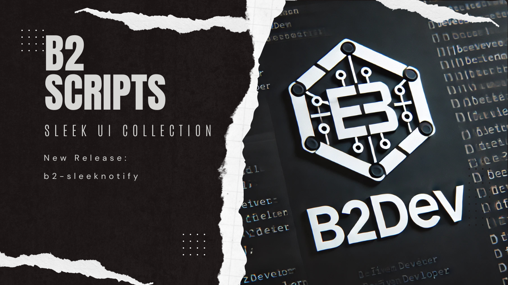
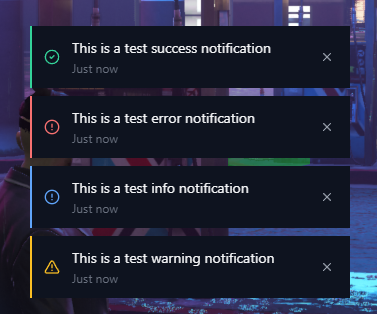
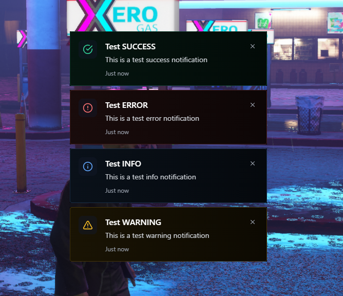

# B2-SleekNotify


A modern, sleek notification system for FiveM with support for multiple styles and positions.


## Preview

### Minimal Style

*Clean, minimalist notifications perfect for essential information*

### Advanced Style

*Rich notifications with titles and enhanced visual styling*

## Features
- Two distinct notification styles:
  - Minimal: Clean, simple notifications with essential information
  - Advanced: Rich notifications with titles and enhanced visual styling
- 9 customizable positions:
  - Top: Left, Center, Right
  - Middle: Left, Center, Right
  - Bottom: Left, Center, Right
- 4 notification types with unique styling:
  - Success (Green)
  - Error (Red)
  - Info (Blue)
  - Warning (Amber)
- Sound effects for different notification types
- Customizable duration
- Modern UI with blur effects and smooth animations
- Notification counter
- Built with React and Tailwind CSS

## Installation

### Production Release
1. Download the latest release from the [Releases](https://github.com/B2DevUK/b2-sleeknotify/releases) page
2. Extract the `b2-sleeknotify` folder to your server's resources directory
3. Add `ensure b2-sleeknotify` to your server.cfg
4. Restart your server

### Development Installation
1. Clone the repository
```bash
git clone https://github.com/B2DevUK/b2-sleeknotify.git
```
2. Navigate to the UI directory and install dependencies
```bash
cd b2-sleeknotify/ui
npm install
```
3. Build the UI
```bash
npm run build
```

## Usage

### Client-Side Usage
```lua
-- Basic notification (minimal style)
exports['b2-sleeknotify']:CreateNotification({
    type = 'success',
    message = 'Vehicle stored successfully!',
    position = 'TOP_RIGHT'
})

-- Advanced notification with title
exports['b2-sleeknotify']:CreateNotification({
    type = 'success',
    title = 'Vehicle Stored',
    message = 'Your Sultan RS has been stored in Legion Square Garage',
    position = 'TOP_RIGHT'
})
```

### Server-Side Usage

The notification system provides several server-side exports for different notification scenarios:

```lua
-- Send to specific player
exports['b2-sleeknotify']:SendToPlayer(playerId, {
    type = 'success',
    title = 'Vehicle Stored',
    message = 'Your vehicle has been stored successfully!',
    position = 'TOP_RIGHT'
})

-- Send to all players
exports['b2-sleeknotify']:SendToAll({
    type = 'info',
    title = 'Server Announcement',
    message = 'Server restart in 5 minutes',
    position = 'TOP_CENTER'
})

-- Send to multiple specific players
exports['b2-sleeknotify']:SendToPlayers({1, 2, 3}, {
    type = 'warning',
    title = 'Area Alert',
    message = 'Restricted area ahead',
    position = 'TOP_RIGHT'
})

-- Send to players within a radius
exports['b2-sleeknotify']:SendToRadius(coords, 100.0, {
    type = 'info',
    title = 'Local Event',
    message = 'A local event is starting nearby',
    position = 'TOP_RIGHT'
})
```

### Configuration
In `config.lua`:
```lua
Config = {
    Style = 'minimal', -- 'minimal' or 'advanced'
    DefaultPosition = 'TOP_RIGHT',
    DefaultDuration = 5000,
    DefaultType = 'info'
}
```

### Available Options

#### Notification Types
- `success`
- `error`
- `info`
- `warning`

#### Positions
- `TOP_LEFT`
- `TOP_CENTER`
- `TOP_RIGHT`
- `MIDDLE_LEFT`
- `MIDDLE_CENTER`
- `MIDDLE_RIGHT`
- `BOTTOM_LEFT`
- `BOTTOM_CENTER`
- `BOTTOM_RIGHT`

## Development
For development with hot reloading:
```bash
cd ui
npm run dev
```

## Credits
- Created by B2DevUK
- UI Design inspired by modern web practices
- Built using React and Tailwind CSS

## Support
For issues, feature requests, or support:
- Create an issue on GitHub
- Join our Discord: [B2 Scripts](https://discord.gg/KZRBA6H5kR)

## License
This project is licensed under the MIT License - see the [LICENSE](LICENSE) file for details.

## Changelog
### v1.2.0
- Enhanced server-side implementation with new exports
- Added radius-based notifications
- Added support for sending to multiple players
- Improved notification tracking
- Updated documentation

### v1.1.0
- Added advanced notification style
- Added position support
- Fixed notification stacking issues
- Added sound effects
- Improved test commands

### v1.0.0
- Initial release
- Basic notification system
- Minimal style support